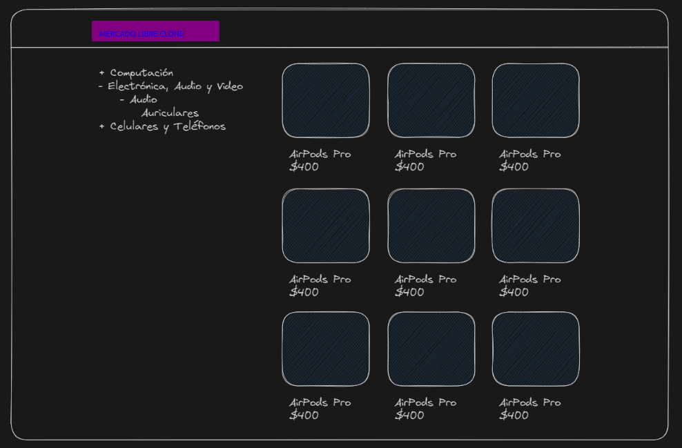

This project uses [Next.js](https://nextjs.org/) bootstrapped with [`create-next-app`], TypeScript y Tailwindcss.

## Run locally

First, run the development server:

```bash
npm run dev
# or
yarn dev
# or
pnpm dev
```

Open [http://localhost:3000](http://localhost:3000) with your browser to see the result.

### `Link WebSite`

[Clone -Mercado Libre- from a seller](https://nalancay-productseller.netlify.app).

## Resources

- The Mercado Libre API has an endpoint that allows you to search for products from a particular seller, the endpoint is `https://api.mercadolibre.com/sites/MLA/search?seller_id=179571326`.

## Requirements

1. - When entering the `/` route we should see a list of all the seller's products in the form of a grid.
2. - When entering the route `/[category_id]` we should see a list of products corresponding to that category.
3. - On all routes, we should see a menu on the left with the available categories. Categories should be displayed in a tree form, i.e. if a category has subcategories, they should be displayed as a submenu.
4. - Categories should start collapsed, and clicking a `-` or `+` button should expand or collapse individually.
5. - Categories must maintain their expand/collapse state when navigating between routes.
6. - When clicking on a category, we should navigate to the corresponding `/[category_id]` path.
7. - When clicking on a product it should redirect us to the Mercado Libre website for that product.

## Example

[](./assets/mock.png)

> Note: The design is free and responsive.
